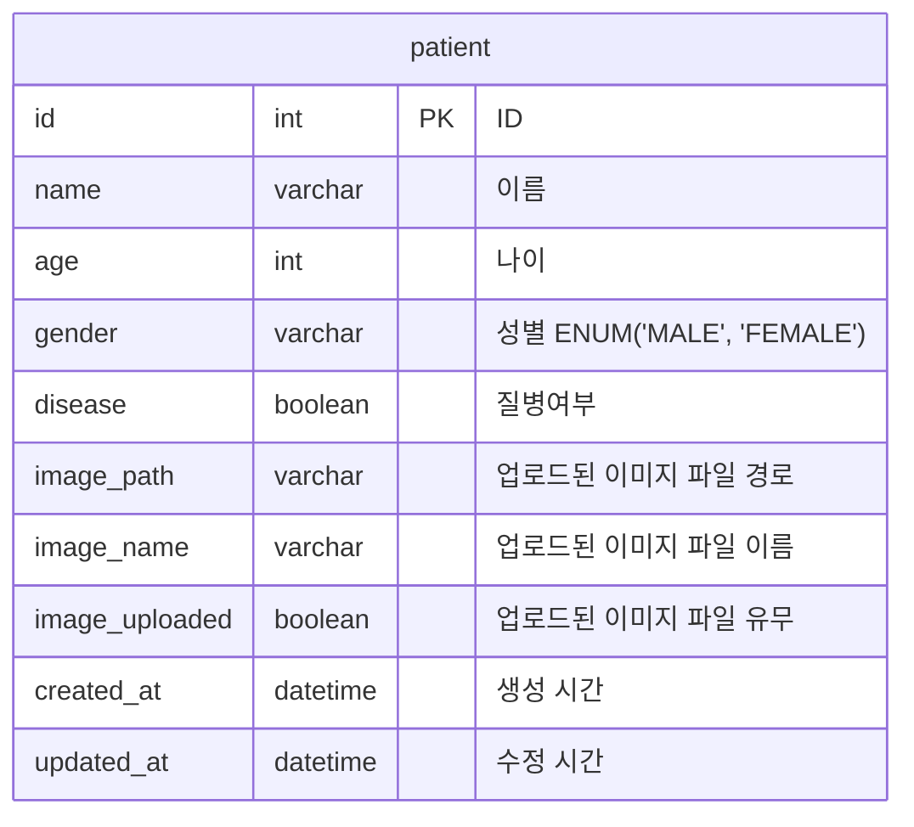

# ERD

```mermaid
erDiagram
    patient {
        id int PK "ID"
        name varchar "이름"
        age int "나이"
        gender varchar "성별 ENUM('MALE', 'FEMALE')"
        disease boolean " 질병여부"
        image_path varchar "업로드된 이미지 파일 경로"
        image_name varchar "업로드된 이미지 파일 이름"
        image_uploaded boolean "업로드된 이미지 파일 유무"
        created_at datetime "생성 시간"
        updated_at datetime "수정 시간"
    }
```
